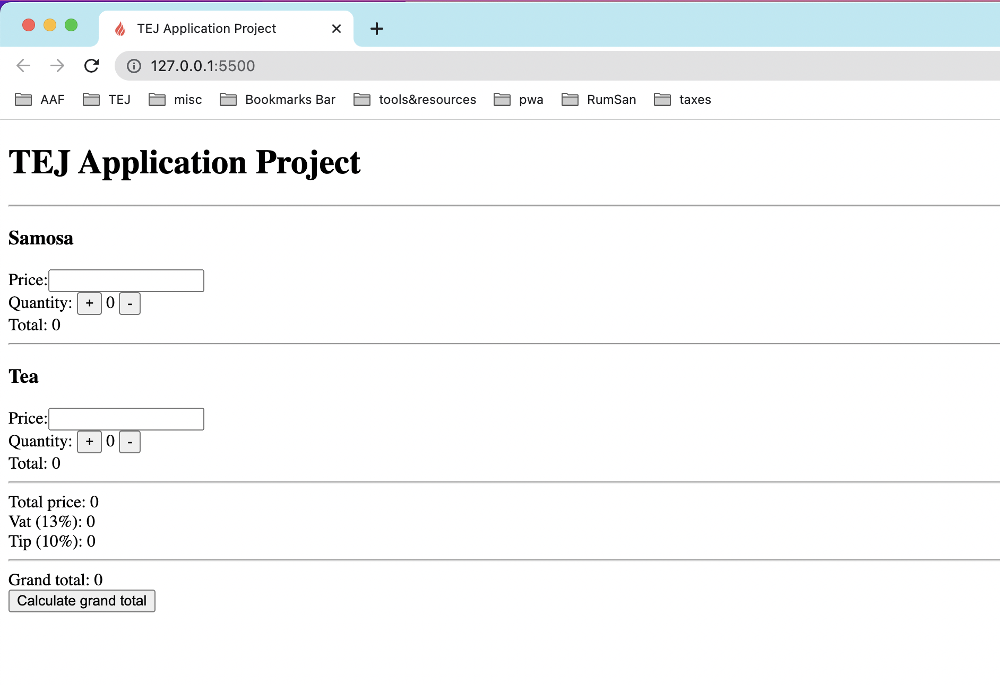
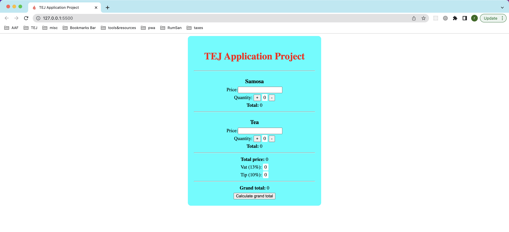
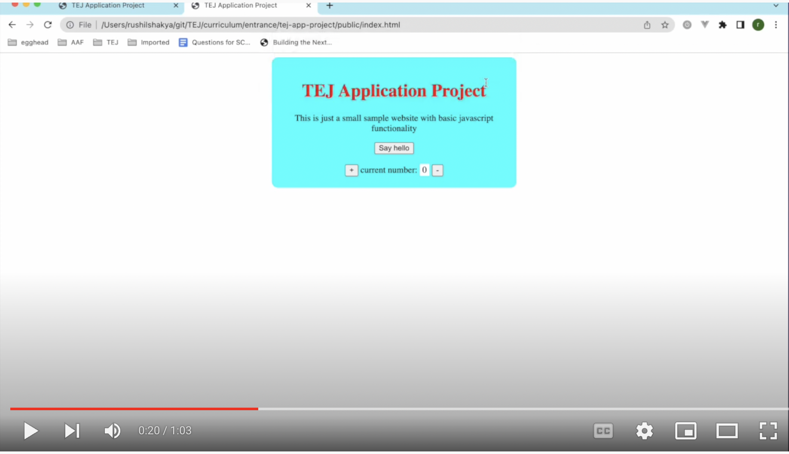
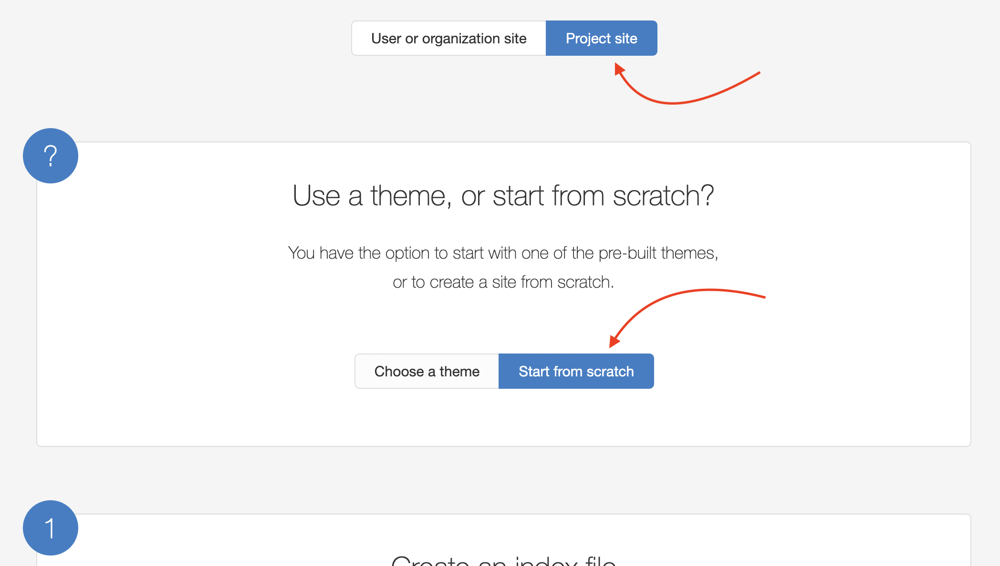

# Tej Fellowship Appliction Round 2 Project

Please read the instructions below for the **TEJ Fellowship application - round 2 project**

### 1. WHAT TO SUBMIT

Complete the 3 levels of tasks (_LEVEL-1 Goal, LEVEL-2 Goal, and LEVEL-3 Goal_) outlined below in the [PROJECT DETAILS](#project-details) section. Once you have completed level 1, keep working on the same code to do level 2 work, and then continue with level 3 on the same code. Only submit the latest code you have worked on. For example:

- if you have successfully completed level 1, 2, and 3, then only submit code for level 3.
- if you have successfully completed level 1 and 2. And you have done some work on level 3, then still only submit code for level 3.

The goals do not have to be completed sequentially, e.g. you can start at **LEVEL-1 Goal**, then do **LEVEL-3 Goal** before completing **LEVEL-2 Goal**.

Please submit the project once you have completed up to whichever goals you are able to achieve.

You can use any online reference for help with the project. But you need to understand and be able to explain what the code is doing line by line, and also be able to make requested modifications to your submitted code if asked during live interview session.

### 2. WHEN TO SUBMIT

You have time from Monday, March 27 2023 morning till Sunday, April 2 2023 night to submit this project.

### 3. HOW TO SUBMIT

1. **Prepare your submission** - Once you have completed your project, you can submit your code using one of the following two methods:

   a. Submit as a public github repository (this is the preferred way)

   - create a git repository as _firstname-lastname_; for example, if your name is `meera rai`, then the git repository name should be `meera-rai`.
   - checkin all your code to the repository
   - create a github account (if you don't have one)
   - push your repository as a public repository to your github account. e.g. if your github userid is `mrai`, then the github url for the repo will be: https://github.com/mrai/meera-rai
   - **_BONUS_**: use github pages to host the pages from this github repository

   b. Submit as a zip file

   - zip the folder with your project
   - name the zip file as: tej-fellowship-_your-full-name_.zip (e.g. if your name is _Tenzin Nepal_, then filename will be tej-fellowship-tenzin-nepal.zip)

2. **Submit it!** - Fill out this google form with the details of your submission: https://forms.gle/VULJZEYT5YAaRTEN6

That's it! read the instructions below to complete the project. If you have any questions on the process, please email us at tej.fellowship@gmail.com with the subject "TEJ Fellowship application project question 202305".

---

## PROJECT DETAILS

### Please read and implement the goals below

**LEVEL-1 Goal**:

> 1. Create an **_index.html_** file in the root directory for the project
> 2. Then put html tags in the index.html to make it look like this
>    

**LEVEL-2 Goal**:

> 1. Create a **_styles.css_** file in a folder named 'css'
> 2. Include a reference from index.html to styles.css so that css styles from styles.css will apply to elements in index.html
> 3. In the styles.css file add styles to make the index.html page look like this
>    

**LEVEL-3 Goal**:

> 1. Create a **_scripts.js_** file in a folder named 'js'
> 2. Inclue a reference from index.html to scripts.js so that any javascript code in scripts.js can access the elements in index.html
> 3. In the scripts.js file, add the below 4 functionalities
>    1. add code so that an alert box with the message "Hello TEJ!" is displayed when index.html page is loaded
>    2. add code to input `Price` as a number to the input box next to the `Price` label in both `Samosa` and `Tea` sections
>    3. add code so that when
>    - the '+' button is clicked, the value in the "Quantity" box is incremented by 1 in the corresponding section (e.g. '+' button in `Samosa` section should increment the quantity under the `Samosa` section, and '-' button in `Tea` section should increment the quantity under the `Tea` section)
>    - the '-' button is clicked, the value in the "Quantity" box is decreased by 1 in the corresponding section
>    4. add code so that when the `Calculate grand total` button is clicked then
>    - the `Total` field of `Samosa` section is populated with `Price` x `Quantity` of `Samosa`. E.g. if you put `50` as the `Price` for `Samosa`, and `4` as `Quantity`, then the `Total` value should be `200`, which is equal to `50` x `4`
>    - the `Total` field of `Tea` section is populated with `Price` x `Quantity` of `Tea`. E.g. if you put `25` as the `Price` for `Tea`, and `2` as `Quantity`, then the `Total` value should be `50`, which is equal to `25` x `2`
>    - the `Total price` field is populated by adding `Total` of `Samosa` and `Tea`. E.g. if `Samosa` total is `200` and `Tea` total is `50`, then `Total price` should be `250`
>    - the `Vat (13%)` field is populated by calculating 13% of `Total price`. E.g. if `Total price` is `250`, then `Vat (13%)` should be `32.5` which is equal to 250 x 0.13
>    - the `Tip (10%)` field is populated by calculating 10% of `Total price`. E.g. if `Total price` is `250`, then `Tip (10%)` should be `25` which is equal to 250 x 0.1
>    - the `Grand total` field is populated by adding `Total price`, `Vat (13%)`, and `Tip (10%)`. E.g. if `Total price` is `250`, `Vat (13%)` is `32.5`, and `Tip (10%)` is `25`, then `Grand total` should be `307.5`

_note_: watch this video to see how the web page should behave

---

### _Resources_

Here are a few resources you can read to help with the project

- You can read [this article](https://rushilshakya.github.io/tej-curriculum-pre-bcp/what-is-webapp) for basic concepts on webapps
- To create github pages, follow instructions at https://pages.github.com/ > choose 'Project site' > 'Start from scratch'
  
