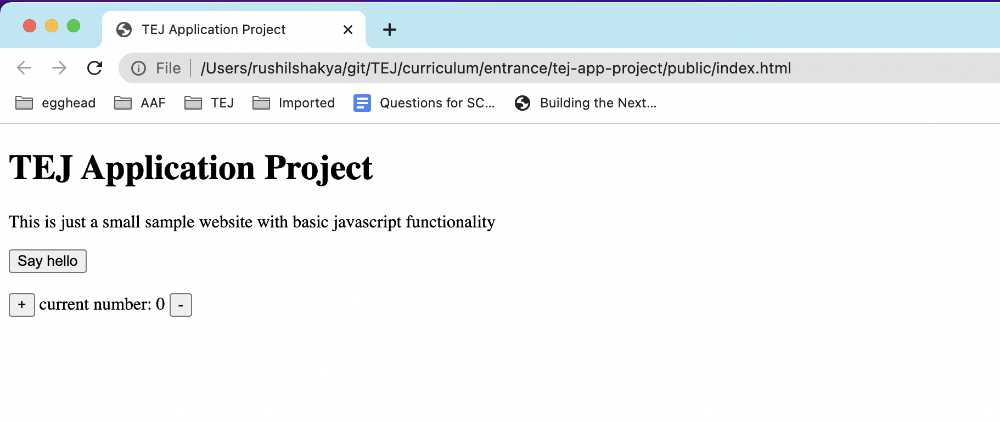
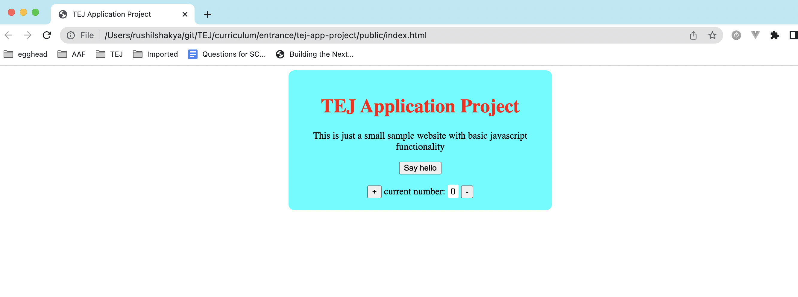

# tej-app-project

Please read the instructions below for the **TEJ Fellowship application - project round**

### 1. WHAT TO SUBMIT

Submit the files you create to complete the 3 levels of tasks outlined below - **LEVEL-1 Goal**, **LEVEL-2 Goal**, and **LEVEL-3 Goal**.

The goals do not have to be completed sequentially, e.g. you can start at **LEVEL-1 Goal**, then do **LEVEL-3 Goal** before completing **LEVEL-2 Goal**.

Please submit the project once you have completed up to whichever goals you are able to achieve.

You can use any online reference for help with the project. But you need to understand and be able to explain what the code is doing line by line, and also be able to make requested modifications to your submitted code if asked during live interview session.

### 2. WHEN TO SUBMIT

You have time from Monday, April 11 morning till Sunday, April 17 night to submit this project.

### 3. HOW TO SUBMIT

You can submit your code using one of the two below methods

a. Submit as a public github repository (this is the preferred way)

- create a git repository called tej-fellowship
- checkin all your code to the repository
- create a github account (if you don't have one)
- push your repository as a public repository to your github account
- **_BONUS_**: use github pages to host the pages from this github repository

b. Submit as a zip file

- zip the folder with your project
- email it to tej.fellowship@gmail.com

That's it! read the instructions below to complete the project. If you have any questions on the process, please email us at tej.fellowship@gmail.com with the subject "TEJ Fellowship application project question".

---

## Please read and implement the goals below

**LEVEL-1 Goal**:

> 1. create an **_index.html_** file.
> 2. Then put html tags in the index.html to make it look like this
>    

**LEVEL-2 Goal**:

> 1. Create a **_styles.css_** file in a folder named 'css'.
> 2. Include a reference from index.html to styles.css so that css styles from styles.css will apply to elements in index.html
> 3. In the styles.css file add styles to make the index.html page look like this
>    

**LEVEL-3 Goal**:

> 1. Create a **_scripts.js_** file in a folder named 'js'.
> 2. Inclue a reference from index.html to scripts.js so that any javascript code in scripts.js can access the elements in index.html
> 3. In the scripts.js file, add 3 functionalities
>    1. add code so that an alert box with the message "Hello TEJ!" is displayed when index.html page is loaded
>    2. add code so that when the 'Say hello' button is clicked, an alert box with the message "Hello there!" is displayed
>    3. add code so that when
>    - the '+' button is clicked, the value in the "current number" box is incremented by 1
>    - the '-' button is clicked, the value in the "current number" box is decreased by 1

_note_: watch this video to see how the web page should behave

